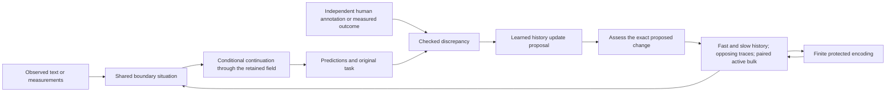

# One continuous history state inside the continuing owner

HISTORY-016 implements the new unified memory addendum through the qualified
SEMANTIC-015 owner. Its 141-test baseline passed; human episode teaching is active.
The [validation record](../reports/HISTORY-016/VALIDATION.json) identifies the tested
source and costs. Trained behavioral qualification follows the frozen campaign.

The diagram describes dependencies in one state evolution. Separate source files
make the mathematics reviewable; they do not create separate trained answer models.

## Conditional transport

Let `D_R z` collect `z_(i+1)-R_i z_i` on the periodic local-vector ring, and
`L_R=D_R^T D_R`. A small network receives four invariant observed summaries and
produces bounded rates. With that conditioning `c` fixed, define

`A(c,R)=diag(a_i(c) I_3)-d(c)L_R`,

`z(1)=exp(A)z(0)`, `z(0)=exp(-A)z(1)`, `log |det J|=Tr(A)`.

Local rotations conjugate the generator, so transport commutes with those frame
changes. The independent test also compares `Tr(A)` with an autograd Jacobian.
For a conditional standard-normal reference, the reverse KL is exactly

`0.5 [Tr(exp(A)exp(A)^T)-3n-2Tr(A)]`.

The small KL penalty is an explicit regularizer; it does not certify knowledge.
This is a finite vector-fiber flow. [Gerdes et al., version 1](https://arxiv.org/abs/2410.13161v1)
instead construct flows on matrix-group links from invariant loop information.
Their equivariance principle informs the contract, while their full SU(N) sampling
architecture remains a distinct implementation. Replicating a value along a bulk
depth axis is a stated embedding, not an invertible change of dimension.

## Two timescales and opposing evidence

For encoded teaching signal `e`, fast trace `f` and slow trace `s`,

`f' = f + eta(e-f) + kappa(s-f)`,

`s' = s + beta(f-s)`, with `eta>beta` in the learned-rate model.

Support and opposition are separate nonnegative traces. In teaching they track
same-example annotation-fitting progress; only the distinct query assessment can
qualify transfer or factual retention. They modulate the paired bulk targets at
the next step. Keeping both traces represents conflicting evidence explicitly.

[Benna and Fusi](https://pubmed.ncbi.nlm.nih.gov/27694992/) motivate bidirectional
exchange across timescales. [Yu et al.](https://pubmed.ncbi.nlm.nih.gov/36991495/)
study a particular chromatin transition, and [Kim et al.](https://www.nature.com/articles/nature09342)
show retained cell-of-origin memory. These are biological motivations. The
implemented traces are mathematical variables, not actual histones, stem cells
or quantum superpositions of cell fates.

## Active bulk coupled to those same traces

Two fields `phi_1,phi_2` live on a finite periodic depth/node lattice. In the
checkpoint's stored coordinate frame,

`mu_1 = -0.5 phi_1 + phi_1^3 - kappa_1 Lap(phi_1)
        -(rho+alpha)phi_2 + p(phi_1-target_1)`,

`mu_2 = -0.5 phi_2 + phi_2^3 - kappa_2 Lap(phi_2)
        -(rho-alpha)phi_1 + p(phi_2-target_2)`,

`d phi_i/dt = M_i Lap(mu_i)`.

The Fourier update treats interfacial stiffness implicitly and the other terms
explicitly. Its zero-frequency multiplier is one; hence relaxation preserves
each field's mass. An evidence-driven write injects a separate reservoir increment
and is accounted separately. The two fields contribute back to the same recalled
boundary source alongside the fast and slow traces. Their scalar concentration
coordinates are not rebranded as freely rotating gauge vectors.

The [two-field study by Frohoff-Huelsmann, Wrembel and Thiele](https://doi.org/10.1103/PhysRevE.103.042602)
shows parameter-dependent suppression of coarsening and oscillatory regimes.
This implementation measures its own finite dynamics and task retention. A lower
domain-growth rate does not by itself establish less forgetting. With active
coupling, the passive free energy may increase; its diagnostic is not a rejection
rule that silently restores equilibrium.

## Explicit protected representation

A five-qubit code uses generators `XZZXI`, `IXZZX`, `XIXZZ` and `ZXIXZ`.
The normalized common positive eigenspace supplies an isometry `V:C^2->C^32`.
The scalar map is `p=1/2+atan(value)/pi`, represented as
`sqrt(1-p)|0>+sqrt(p)|1>`, then encoded by `V`.

For the specified correctable error set, the columns of `E_s V` are orthogonal.
Recovery applies `K_s=(E_s V)^dagger` and sums the syndrome-conditioned logical
density matrices. Unknown single-qubit errors use the identity and 15 single
Paulis. Up to two declared erasures use all Pauli products on the known erased
sites. The implementation rejects larger declared erasure sets. It does not
assert that every error outside that contract is detectable.

This finite perfect-tensor cell follows the logical/boundary direction in the
[HaPPY construction](https://arxiv.org/abs/1503.06237). It is simulated on the CPU;
it is not an implementation of a full hyperbolic tensor network, a gravitational
bulk or the entire RT correspondence. Its protected scalars return to the actual
owner on read. The encoded flow identity prevents silent reinterpretation after
geometry changes. The earlier finite Chern codec and earlier memories remain.

The encoding is accepted only after a numerical round trip recovers its input
within the stated tolerance. This rejects saturation of the bounded amplitude
map before any factual write. The recorded geometry includes the transported
connections as well as the learned continuum parameters.

## Procedure learning and independent correction

The support signal is the derivative of human annotation loss with respect to the
actual conditional boundary, detached to specify a first-order procedure learner.
Four support events drive the state above. A different source group supplies the
query assessment, whose loss trains the new update rates and readout gain. Earlier
parameters remain fixed. No next-token objective or external pretrained model is
introduced. The supplied teacher, derivative rule, episode boundaries and ranges
are engineering; the rates/gains altered through teaching are learned.

Factual retention requires the exact proposed state hash and its original goal,
predictor, source, independently assessed outcome and nonrepeated credit. A change
in confidence or a lower internal energy is insufficient. Final assessments
measure proposals without modifying the evaluated owner. Persistent delivery uses
a separately identified task and preserves the original goal through restart.

The session withholds the query's human label until after practice has proposed
its state. A separate numerical assessor recomputes the loss from the stored
probabilities and external annotation. A factual write checks the current owner's
identity, the exact proposed state and the performed proposal. Each query is
assessed once, including unsuccessful attempts. Retained history is activated
only in that original goal's scope; other tasks receive the preceding computation.
The eight fixed delivery cases include a deliberately mismatched intervention.

The [whole-research tracker](WHOLE_ARCHITECTURE.md) remains open. This connection
addresses the new history proposal while preserving explicit work on broader
interpretation, learned concept construction, structural growth and learning
efficiency. No individual stability or coding theorem closes those behavior tests.
