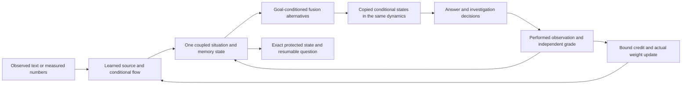

# CORE-022: one fresh owner and persistent coupled state

The candidate is built before its from-scratch curriculum. Its input maps,
geometric energy, memory, conditional alternatives and decision/output maps are
all freshly initialized. It reuses reviewed mathematical code, not trained
tensors. Earlier qualified owners remain separately usable.

## Shared dynamics and learned paths

The state carries boundary multivectors, canonical momenta, symmetric
log-covariance, fast/slow traces, paired active bulk, opposing evidence marks,
retained flow context, an event count and an energy-loss reservoir. An admitted
attachment adds free and disagreement coordinates. The [equations](CORE_022_EQUATIONS.md)
give the common energy and split integrator.

Text slices exhaust the supplied source. Numerical input records an actually
measured response or an explicit missing-response mask. Input is encoded and
settled before a bounded observed port changes the boundary. Retained flow context
participates in the next encoding. Conditional queries copy this full state and
use the same numerical map with their observation counter unchanged.

Independent finite differences check the learning derivative through multiple
events, including shared computational history. Actual losses reach the text and
number input maps, geometry, finite neural action, fast/slow rates, active bulk,
conditional flow, stationary operator and fusion channels. These are learning
path tests; a parameter receiving a gradient is not by itself an acquired skill.

## Persistent investigation and verified learning

`CoreSession` specializes the existing tested question/receipt protocol with this
owner. It retains the original human question, numerical goal, observed events,
pending action, predictor/state identities, transition and consumed assessments.
STOP, unread observations, performed-action mismatch, stale predictors and
duplicate credit have explicit behavior.

An accepted grade computes independently measured original-goal error reduction,
updates actual shared weights, re-encodes retained history under those weights
and returns the original answer. The optimizer and both random states are saved.
Tests compare interrupted and uninterrupted pending decisions and next updates.
The fixtures force particular decisions to exercise validation; they are not
reported as learned curiosity or as a new trained curriculum.

## Executable alternatives and verified portfolios

The same imagined field now produces parallel graph decisions for mathematical
and scalar programming questions. Fresh operation, operand and output weights
construct executable acyclic graphs. The three conditional branches supply their
features and probabilities. There is no separate program-predicting model or
optimizer. The [construction contract](CORE_022_EXECUTABLE_WORK.md) records the
supplied grammar, competing mechanisms and prospective engineering checks.

Every sampled candidate is committed before its independent contract is opened.
An independently written coefficient checker proves supported polynomial
identities; a separate execution contract checks an explicitly finite set of
inputs. These scopes remain attached to returned programs. Alias normalization
removes dead code and elementary rearrangements while retaining different
factorizations. Credit for additional exact methods diminishes and is bounded;
repeated goals, source names or assumption wording do not reset novelty.

Verified credit updates the same AdamW state and re-encodes checked evidence into
the continuing situation. Failed proposals, distinct valid methods and the
original question persist together. A new question retains contribution identities.
Returned expressions and scope explanations are an engineering rendering of
checked programs. The forthcoming course must teach the proposal procedure and
assess its use; this code connection alone does not claim learned discovery.

## Protected storage reads into the owner

The floating-point and integer tensors are encoded **byte for byte**, avoiding
lossy quantization of small memory coordinates. Each byte is represented by one
five-qubit code cell; its eight bits also select gapped scalar-mass QWZ phases.
Decode checks the represented level, phase agreement, schema, payload digest and
goal/predictor/evidence scope. The decoded tensors become the actual resumed
situation and must match independent event replay exactly.

The declared code corrects one unknown Pauli error or up to two declared erasures
per cell. It rejects tested unqualified corruption, closed phase intervals and
changed scope. It uses 512 encoded-array bytes and 64 phase-array bytes per raw
state byte, plus metadata, temporary recovery arrays and process overhead. The
finite allocation permits at most 65,536 raw bytes. This is classical simulation
with an explicit cost, not a compressed or semantically infallible memory.

## Adequacy, attachment and retry

The owner separately receives prediction residuals from actual prior observations
and its internal branch variance. A curvature audit restricts the common action
to three supplied scalar-blade directions. Positive regulated curvature permits
an exact Gaussian log-determinant integral over the stated scale interval;
invalid curvature is recorded rather than converted into an unsupported certainty.
This is a local quadratic diagnostic, not the full interacting Wetterich flow.

A trainable decision uses the same imagined field plus these eight diagnostic
features to choose retain, investigate or attach. Without independent error
evidence only investigation is eligible. The finite supported attachment records
an enlarged stalk, re-encodes the old observations, preserves existing optimizer
moments and returns to the same goal. The old session is saved before mutation;
failure restores it and leaves candidate evidence available. The candidate is
marked pending independent useful-progress assessment. Rank bounds, chart and
decision vocabulary are supplied engineering.

## Work still required before the full course

The [complete work order](COMPLETE_CORE_WORK_ORDER.md) remains controlling.
The executable proposal/assessment and distinct-contribution credit route is
connected and has a separate-process pending-update replay. The
[practice-selection route](CORE_022_LEARNING_WORK.md) uses the same choice map,
weights and optimizer. It records genuine practice updates, assesses acquisition
and retention independently, reconstructs decision-time credit from the preserved
parent, and retries the original goal. Its mid-trial restart also replayed in a
fresh process. Selecting supplied schedules is assessed separately from inventing
an optimizer or demonstrating faster acquisition on the next capability.

The [human teaching views](CORE_022_TEACHING_VIEWS.md) now connect complete
checked arithmetic instances and scalar human programs to this same owner.
The [build acceptance](CORE_022_BUILD_ACCEPTANCE.md) includes all six actual
course derivative paths, exact continuation and a read-only five-use interface
whose assessment requires performed intervention receipts. The fixed
[foundation course](../protocols/CORE-022-FOUNDATION.md) starts from fresh weights.
The complete behavioral evaluation, including the
[five-use correction test](EMPIRICAL_SYNTHESIS_20260921.md), and subsequent
incremental continuation remain required work.
