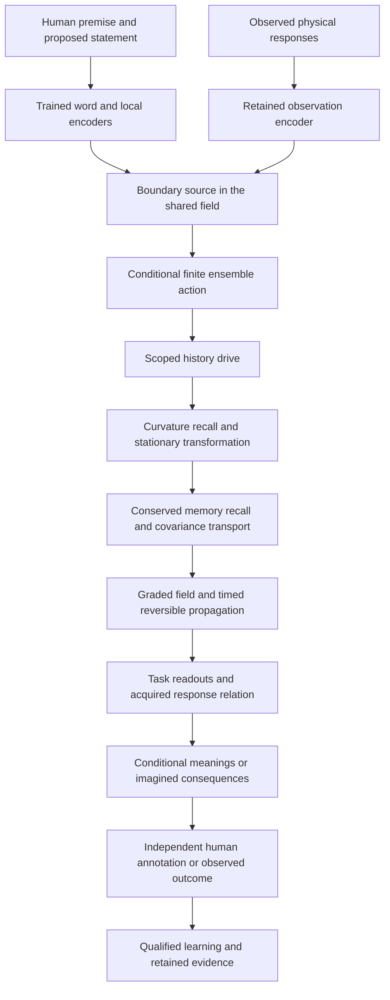

# A conditional neural ensemble with an executable action

The new synthesis asks for higher connected correlations to determine an action
that participates in the learner. [Demirtas et al., section 3](https://arxiv.org/html/2307.03223v2#S3)
derive actions perturbatively from cumulants and distinguish this from constructing
a parameter distribution for a chosen action. I use the following finite
conditional construction to make both descriptions numerically inspectable.
It is a classical statistical field, with a declared discretization and scope.

For context c, let F be a learned N-by-D matrix, N=4, D=3 times the number of
boundary vertices. Independent signs s_i in {-1,+1} and Gaussian epsilon define

    z = F(c)^T s + sigma epsilon.
    p(z|c) = 2^-N sum_s Normal(z; F(c)^T s, sigma^2 I).
    S(z|c) = -log p(z|c).

Finite summation makes this density positive and normalized without a truncated
polynomial tail. The sign ensemble is part of the supplied architecture; training
learns F and sigma. It is not counted as independently invented alternatives.

    K(J|c) = sigma^2 ||J||^2/2 + sum_i log cosh(F_i.J)
    C = sigma^2 I + F^T F
    G4[a,b,c,d] = -2 sum_i F[i,a] F[i,b] F[i,c] F[i,d].

The exact force is

    -grad_z S = (E[ F^T s | z,c ] - z) / sigma^2.

For q=C^-1 z, u_i=F_i.q and v_i=F_i.C^-1.F_i, the first fourth-cumulant
correction to the Gaussian density is

    delta4 = -sum_i (u_i^4 - 6 u_i^2 v_i + 3 v_i^2) / 12.
    S4 = S_G - delta4.

The formula follows by contracting the fourth Gaussian Hermite tensor with G4/24.
It is an approximation assessed against the exact mixture, not substituted as
an exact global density. A reported negative value of 1+delta4 is an approximation
breakdown, never a valid negative probability. For F_i=f_i/sqrt(N), G4 has the
stated 1/N scaling with identical fixed features. No asymptotic limit is assumed
at N=4.

The feature generator combines source vectors and both neighboring vectors
transported to the same vertex. Scalars computed from vector norms and inner
products condition their coefficients. Under an orthogonal local frame change G,
z and each mixture mean transform by the same block-orthogonal map, preserving
the density and transforming the force covariantly. A per-vertex norm bound on
the force retains that property; coordinatewise clipping would not.

The update is z plus a learned bounded multiple of this force. It feeds the
existing continuing field, so its behavior can be tested through actual human
interpretation and retained physical tasks. Zero initial gain reproduces the
parent exactly in deterministic mode. Noise during teaching is recorded as an
explicit perturbation; an equal-curriculum clean arm measures its effect.

Density derivatives hold c and F(c) fixed. Task gradients also train the
conditional generator; these are different derivatives. This conditional action
does not supply a normalized marginal distribution for an arbitrary raw textbook.
The [prospective protocol](../protocols/GENRE-017.md) binds implementation,
teaching, independent metrics, retention and publication to that precise scope.

## Actual route through the continuing owner

The arrows describe the implemented computation order, not a claim that the
composition is one isolated physical Hamiltonian. They are implemented by
`GenreOwner` and `EnsembleField`, extending the same retained owner. A valid
conditional hypothesis remains distinct from an observation received at V.

The semantic task first encodes the observed premise, then evaluates three
learned conditional continuations from that state. Their three-way probabilities
are averaged for the returned interpretation. The physical task uses this same
field before acquiring coefficients and optional residual features from actual
observations. The encoder/readout shapes, finite candidate structure and human
annotations are supplied; gradients teach the mappings and new action parameters.

In GENRE-017, semantic and finite-action parameters receive gradients throughout
the curriculum. The shared word/local encoder is enabled after the first 1,024
primary updates at one-tenth their learning rate. Earlier-subject rehearsal is
interleaved. Existing field parameters and stored factual memories are protected;
their presence does not mean every memory mechanism was newly trained in this
study. The independent audit compares both their identities and actual retained
task performance.
