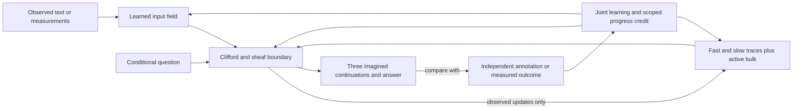

# A core that learns memory, perception and imagination together

## Why a fresh experiment

The supplied research makes memory part of the development of the situation
itself. The historical field lineage began with geometry and physical learning;
UNIFIED-012, SEMANTIC-015 and HISTORY-016 subsequently added richer memory routes.
HISTORY-016 froze the previous owner and trained its new memory parameters using
detached support-error gradients. Its selected state was step zero. That result
does not isolate the cause: initialization, signal quality, optimization, capacity
and the restricted learning schedule all remain candidate explanations.

NATIVE-019 tests a different, explicit contract. `NativeOwner` directly inherits
`torch.nn.Module`; it loads no parent, pretrained vocabulary or earlier weights.
The input maps, rotor connections, observed-state writer, active memory and
conditional answer maps are initialized together and trained together.

This is one coupled state transition with different mathematical variables and
input/output maps. Sharing a Python owner is checked separately from whether the
retained state actually helps a task.

## Actual equations and execution

The state is `(fast, slow, marks, bulk, flow_context)`. Eight local vector stalks
feed graded `Cl(3,0)` boundary coefficients. Let `u` be the learned observed input,
`r(m)` the decoded retained state and `g = 0.1 + sigmoid(g_raw)`. The boundary
settles under the existing sheaf action using source `u + g r(m)`. Its writer is

`stimulus = 0.5 u + 0.5 tanh(W_write flatten(boundary))`.

That stimulus enters the conditional linear gauge flow, fast/slow traces and
paired nonreciprocal conserved relaxation derived in
[the continuous-history equations](CONTINUOUS_HISTORY_EQUATIONS.md). The slow
rate remains below the fast rate. Evidence-driven injection and subsequent
mass-conserving relaxation are measured separately. Gradients pass through the
writer, flow and retained state to the earlier observed input; no detached
teacher-gradient vector stands in for a learned encoder.

A question is encoded into the same local coordinates. Three learned conditional
offsets generate boundary continuations from that question and the retained
state. Shared answer features include the recalled/query relation and the
resulting geometric state. Only small output maps differ between three-way
sentence relations, source-choice scoring and scalar physical responses.
The original observation is not supplied again at query time.

Text uses a learned hashed word table and local convolution before its geometric
projection. Each observed text is consumed in two exhaustive contiguous source
slices; these are encoding events, not extra human-authored lessons. Blank slices
do not create observations. Every source token is retained in the input view.
Physical input supplies force, velocity and an observed acceleration; an imagined
query supplies force and velocity only. Hidden simulator parameters stay with
the assessor. The numerical input map receives the supplied coordinates
`(force, velocity, response, force*velocity, velocity^2, observed_flag)`; query
responses are zero with a false observation flag. The product and square are
engineered features. The learner is not credited with discovering those variables
or with identifying a hidden physical family from its label.

Observed updates return a new state. Conditional branches read state without
changing it. Checkpoint identity, source receipts and original-goal records remain
explicit so the independent assessment can distinguish actual observations from
predictions. Opposing evidence marks have their stated checked-progress meaning;
unassessed examples do not receive invented positive marks.

Ordinary teaching keeps those marks at zero. Persistent delivery later records
independently assessed positive and negative progress. Learning a procedure from
sequences of such graded histories is a separate acceptance target; this course
measures joint observed-state learning and the integrity of its credit interface.

There are two persistence timescales. Learned parameters carry acquired mappings
across lessons. An observed field state carries the history of one particular
situation. Training starts a new state for each independent text or physical
episode while continuing to update the same parameters. A live session instead
saves that situation's state and goal between commands. This separates what was
learned across the curriculum from what was observed about a particular world.
The study's history horizons are two text slices or four physical observations;
the persistent delivery adds a fifth measured observation. Source receipts and
checkpoint manifests identify these states without replacing their learned
numerical contents.

## Teaching and what the measurements mean

The [frozen protocol](../protocols/NATIVE-019.md) gives all counts, schedules,
partition rules and qualification gates. Human material includes MultiNLI,
dictionary, conversation, grammar, philosophical prose, calculus, programming,
reading and annotated arithmetic. Physics uses separately attributed simulated
force/velocity systems. The learner is taught the supplied tasks; the generator,
labels, arithmetic operands and candidate answers are engineering inputs.

The arithmetic task chooses among operations/equivalent exact results with two
operands supplied by a human worked step. Source-pair teaching selects among
human answer passages. These measurements describe the exact task taught.

Three fresh arms receive identical examples and update counts. The native arm
uses fast/slow/bulk dynamics throughout. The delayed arm retains a basic observed
trace first and adds the richer dynamics halfway through. The trace arm keeps
basic observed memory throughout. Each arm can use the observations from its
first lesson. The basic trace shares the encoder, boundary, flow and decoder,
with a fixed 0.5 write/retention mixture. The delayed arm has fewer updates with
the richer dynamics enabled, so the comparison estimates this developmental
schedule as a whole. It does not prove an inherent inability of a later memory
addition to become integrated. The [prospective amendment](../protocols/NATIVE-019-AMENDMENT.md)
preserves the original weaker design and explains the correction before training.

The audit checks first-lesson gradients, parameter changes, history erasure,
bulk removal, rate changes, conditional branch isolation, fresh-source transfer,
checkpoint restart and an independently checked measurement-to-returned-answer
cycle. All previous checkpoints remain available; no unevenly trained comparison
silently replaces the earlier production choice.

The inference interventions have exact scopes. `no_bulk` removes bulk from the
final query's recalled mixture after observed history was acquired normally.
`no_imagination` bypasses the conditional query's settling steps; observed-state
encoding is retained. `equal_rates` changes the fast/slow rate relation while
reconstructing the observed episode. `erase_history` gives the query a genuinely
empty state. These operations answer different dependency questions and are not
interchangeable measures of the complete subsystem's training contribution.

Every learned memory gain is active at initialization. The fast update is a
convex combination of its preceding fast trace, the encoded observation and the
slow trace: its positive coefficients sum to one because the fast rate is below
0.5 and cross-feedback below 0.1. The slow update is likewise a convex mixture.
The conditional flow generator has a bounded diagonal and a negative
semidefinite connection-Laplacian term. These local numerical contracts help
control the traces; they are distinct from the explicit bulk range guard and
from measured task accuracy. Each actual gradient and parameter change is kept
in the joint-learning audit rather than inferred solely from a connected graph.

## Research alternatives and mathematical scope

[Ba et al.](https://proceedings.neurips.cc/paper/2016/hash/9f44e956e3a2b7b5598c625fcc802c36-Abstract.html)
demonstrate learned interaction between ordinary activations and faster changing
memory weights. This motivates testing developmental coupling, without claiming
that our concentration fields implement their algorithm.
[Bodnar et al.](https://papers.neurips.cc/paper_files/paper/2022/hash/75c45fca2aa416ada062b26cc4fb7641-Abstract-Conference.html)
study learned sheaf geometry and diffusion; its usefulness depends on the data
and the learned maps. [Saha et al.](https://arxiv.org/abs/2005.07101) describe
nonreciprocal conserved dynamics and distinct pattern-forming regimes. A dynamic
pattern is an architectural candidate, while semantic retention is tested on
returned answers.

The research's Chern codes, five-qubit storage, neural-field actions, temporal
echo and actual stalk attachment have preserved implementations and individual
contracts in the [source audit](WHOLE_ARCHITECTURE.md). NATIVE-019 specifically
tests joint developmental learning of perception, history and imagination. Its
fresh weights do not silently inherit the earlier owners' learned abilities or
turn every mathematical primitive into a demonstrated cognitive behavior.
